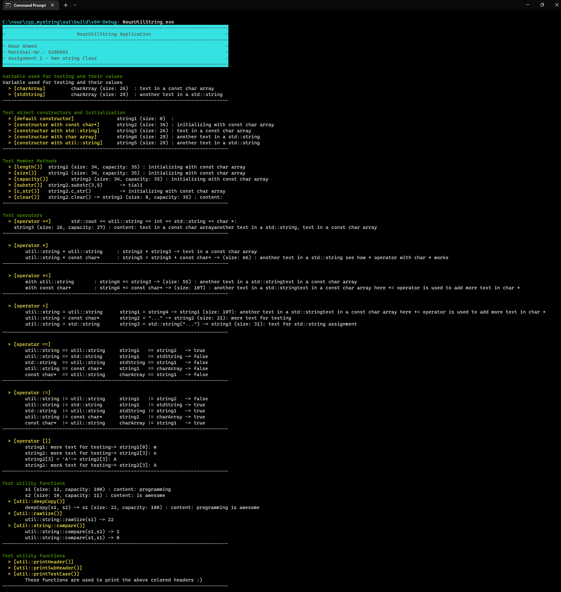

# cpp_mystring
> Implementation of Own String Class
 
 In this presents an implementation of a class named `util::string`. This class behavior is similar to the `std::string` and both  `std::string` and this `util::string` class are compatible.

Full and detailed examples of uses and tests of the class `util::string` are given in the `main.cpp` file. Each method and operator is very carefully tested (e.g., concatenating different strings, ..., etc).

An example test run is shown in the following screenshot:

Note that the **terminal output is cloned** (using [ANSI escape codes](https://en.wikipedia.org/wiki/ANSI_escape_code)) for better visibility.

**Doxygen** generated documentation (in html and LaTeX formats) can be found at [`doc/html/index.html`](doc/html/index.html) and [`doc/latex/refman.pdf`](doc/latex/refman.pdf), respectively. The configuration file `Doxyfile` is used with the Doxygen generation tool.

The following design and implementation criteria are followed:
* No C/C++ standard functions or classes are used to realize `util::string` class. This include, e.g., `strcmp`, `strlen` and of course using `std::string` as an internal representation of `util::string`.
  * This means own functions/methods are developed and implemented to calculate the length of a `char*`, to compare character sequences or to copy them full or partially.
* For now, **no error handling** (e.g., accessing an invalid index by using operator []) is implemented. THis may be done later.
  * **Use this class at your own risk** :).
* THe code follows [LLVM Coding Standards](https://llvm.org/docs/CodingStandards.html).
* The *[sanke_case](https://en.wikipedia.org/wiki/Snake_case)* naming convention is used for variable and function names (with few exceptions).

 ## General Functionality
* The class `util::string` is implemented inside the two files `utilstring.cpp` and `utilstring.h`
* Class string is within the namespace `util`
* The memory management is done by using a pointer (`internal_buffer`) pointing to the data type char. `char*` are (normally) null terminated. This means, that the last character is always a `\0` (NULL character) which marks the end of a char sequence. This character is never printed as it just allows for detecting whether the end of a char sequence has been reached. The string is always null-terminate (internally!)
* Initially, the class provides memory for 10 printable characters. Note that this default value is provided by the constant `INITIAL_SIZE` (defined at the top of `utilstring.h`). It can be changed if another value is desired. 
* A relatively simple concept is designed and implemented to extend the internal memory if `util::string` has to store more than 10 characters.

## Constructors
The following constructors are implemented:
* `string()` : Default constructor with empty initialization
* `string(size_t intialSize= INITIAL_SIZE)` : constructor with parameter for the initial memory size to initialization with.
* `string(const string&)` : Copy constructor: Creates a deep copy of a passed string.
* `string(const char*)` : Constructor with parameter `const char*`.
* `string(const std::string&)` : Constructor with parameter std::string.

## Operators
The following operators are implemented:
* Operator + and += such that string, std::string and (const) char* can be added
* Assignment operator = such that string, std::string and (const) char* can be assigned
* Comparison operators == and != such that comparisons with `util::string`, `std::string` and `(const) char*` are possible. With respect to the last two cases, `std::string` and `const char*` may both be LHS as well as RHS arguments.
* operator [] to access individual characters of `util::string` object.
* Streaming operator << to print `util::string` to `std::cout`.

## Methods
The following methods are implemented:
* `clear()`: Clears your string object
* `substr(pos, length)`: Returns a substring object of type util::string which starts at pos. Parameter length specifies the amount of characters of the new `util::string` to be returned.
* `length()`: Returns the amount of characters of your string excluding `\0`. Might be smaller than the actual reserved memory.
* `c_str()`: Allows raw access to the internal C-string respectively the `char*` pointer

## References
* Standard Strings library : https://en.cppreference.com/w/cpp/string
* C++ ISO Standard https://isocpp.org/std/the-standard
* C++ documentation - DevDocs : https://devdocs.io/cpp/
* LLVM Coding Standards: https://llvm.org/docs/CodingStandards.html
* sanke_case convention : https://en.wikipedia.org/wiki/Snake_case
* Markdown Basic Syntax : https://www.markdownguide.org/basic-syntax
* Doxygen : https://www.doxygen.nl/index.html
